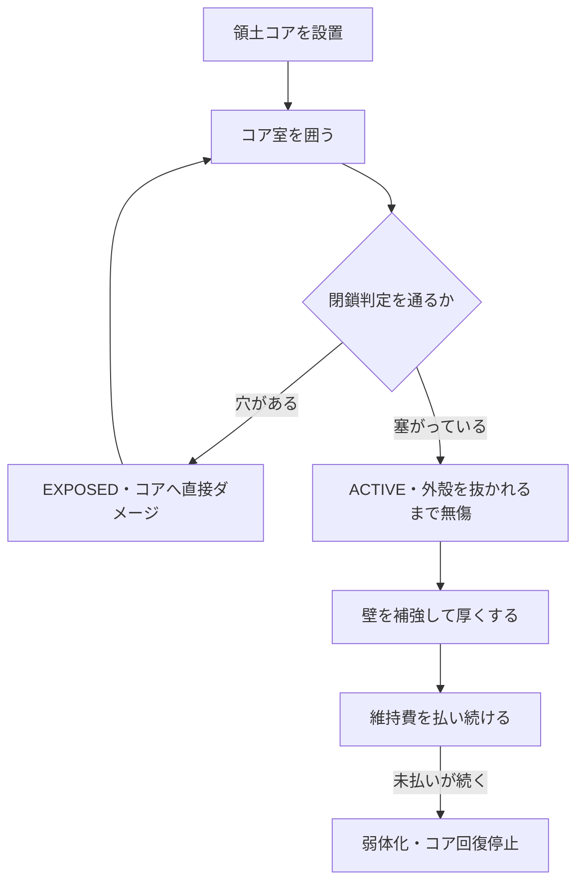

拠点の中心は**領土コア**です。コアが守られている限り土地は自分のもので、
コアが露出すれば戦争の標的になります。

守りの本体は「厚さ」ではなく**閉鎖**です。まず塞ぐ、次に厚くする、の順で読んでください。

## 閉鎖が成立している状態

コアが完全に囲まれていると、領土コアは `ACTIVE` のままです。
この状態では**外殻を抜かれるまでコアHPは減りません。**

```voxel
title: ACTIVE ― 閉鎖が成立したコア室
legend:
  # = 補強ブロック #4e5a48
  ~ = 手前の壁（透過表示） #4e5a48 ghost
  C = 領土コア #9bc86a
layers:
---
#####
#####
#####
#####
~~~~~
---
#####
#...#
#...#
#...#
~~~~~
---
#####
#...#
#.C.#
#...#
~~~~~
---
#####
#...#
#...#
#...#
~~~~~
---
#####
#####
#####
#####
~~~~~
caption: 手前の壁は中が見えるよう透過表示にしています。実際は他の面と同じ補強ブロックです。
```

## 漏出している状態

囲いに1ブロックでも穴があると、コアは `EXPOSED` へ移り、**コアへ直接ダメージが通ります。**
補強の厚さは関係ありません。

```voxel
title: EXPOSED ― 壁に破口がある
legend:
  # = 補強ブロック #4e5a48
  ~ = 手前の壁（透過表示） #4e5a48 ghost
  C = 領土コア #9bc86a
  ! = 破口のふち #e05a5a
layers:
---
#####
#####
#####
#####
~~~~~
---
#####
#...#
#...#
#...#
~~~~~
---
#####
#...!
#.C..
#...!
~~~~~
---
#####
#...!
#...!
#...!
~~~~~
---
#####
#####
#####
#####
~~~~~
caption: 右の壁が1ブロック欠けています。この穴ひとつでコアは露出します。厚さは関係ありません。
```

:::caution[天井と床も閉鎖の一部です]
横を固めても、上から掘られれば同じことです。閉鎖判定は**立体**で見ます。
:::

## 作る順番



:::tip[厚さは閉鎖のあと]
補強をいくら厚くしても、閉鎖に穴があればコアへダメージが通ります。
逆に閉鎖が成立していれば、外殻を抜かれるまでコアHPは減りません。
:::

## これから書くこと

:::caution[未執筆]
以下は `siege_gameplay_guide.md` の第3・9・15章から移植します。

- 領土コアの設置条件と範囲
- 閉鎖・漏出判定の正確な条件（どこまでを「囲い」と見るか）
- 補強材料とHPの対応表
- Bastion領土保護
- 国庫・金庫・維持費
- オフライン防御と長期不在
- 車両コアと移動補強
:::
