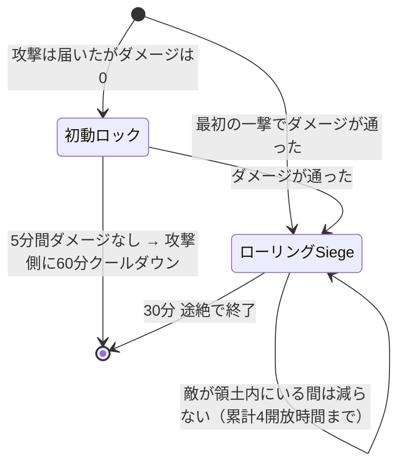
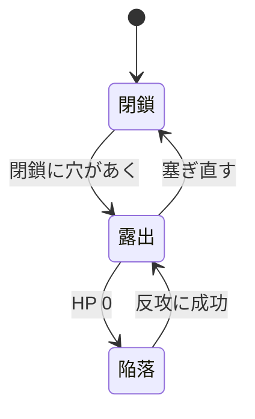

Siegeは、敵国の**領土コア**を破壊して土地を奪う仕組みです。
**このページはルールの説明です。** 効率よく落とす手順は[攻める](../attack/)、
守りの作り方は[拠点を作る](../base/)と[要塞を設計する](../fortress/)にあります。

:::tip[負けても国は消えません]
首都を落とされても国家は残り、中心チャンクと**復興エピソード**から立て直せます。
始める前に[立て直す](../recovery/)を読んでおくと、**どこまでが取り返しのつく範囲か**が分かります。
:::

**敵国の補強ブロックか領土コアを攻撃した時点で、Siegeは始まります。** 宣戦布告の操作はありません。
ただしコアが**露出していない**うちは、何で殴っても壁を削っているだけです。
まず閉鎖を破るのが前提で、[拠点を作る](../base/#閉鎖が成立している状態)の裏返しになります。

やることは4段階です。**外側の壁を抜き、コアを露出させ、HPを削り、30分守り切る。**

| 段階 | 時間 | ここで起きること |
|---|---:|---|
| 初動ロック | 5分 | 攻撃はしたが、**ダメージが1も通らなかった**とき |
| ローリングSiege | 30分 | **ダメージが通ったとき。最初の一撃で通れば、いきなりここから始まります** |
| 陥落後 | 30分 | コアHPが0になってから。防衛側が取り返す最後の機会 |
| 決着 | — | 占領、または首都なら復興エピソードの開始 |

**初動ロックは必ず通る段階ではありません。** 壁を1発削れた時点でローリングSiegeが始まります。
初動ロックになるのは、**攻撃が届かなかったとき**だけです。

| 初動ロックになる例 | |
|---|---|
| C4を設置した | まだ爆発していない |
| 遮蔽に防がれた | [遮蔽の原則](../attack/)を参照 |
| 停止中の補強を叩いた | 維持費未払いなどで機能していない補強 |

**コアを削る必要はありません。補強ブロックのHPが減れば、それが有効打です。**

## 時間切れになる条件

Siegeに制限時間はありません。終わるのは**手が止まったとき**です。

**攻撃側** — 殴り続ける限り続きます。手を止めて30分が過ぎると、それまでの戦果に関わらず終了します。
つまり「時間が足りない」ことはなく、**途切れさせないこと**だけが条件です。

**防衛側** — 30分しのげば終わります。さらに、相手が最初の5分間1度もダメージを通せなければ、
そこで終了したうえで**相手に60分のクールダウン**が付きます。

:::note[相手が領土内にいる間、30分は減りません]
攻撃側の誰かが防衛側の領土内に立っている間、**ローリングSiegeの残り時間は止まります。**
壁を殴っていなくても、敵地に居座っているなら包囲は続いている、という扱いです。

**ただし累計で4開放時間分まで**です。それを超えると時間が動き出すので、
攻撃側はどこかで実際にダメージを通す必要があります。

守る側にとっては「待てば終わる」が成立しないということです。**押し返してください。**
:::

:::caution[初動ロックだけではコアの回復は止まりません]
コアの自然回復が止まるのは**ローリングSiege中と陥落中**です。
攻撃が1度もダメージを通せていない状態では、守備側は回復しながら準備できます。
:::

## コアの状態

コアへHPダメージが通るのは**露出**の間だけです。

閉鎖については[拠点を作る](../base/)を見てください。ここでは「穴が開けば殴れる、塞がれば殴れない」とだけ覚えれば足ります。

### コアの自然回復

攻撃を受けた後、**5分間ダメージがなければ**回復が始まり、以後60秒ごとに最大HPの1%を回復します。
次のいずれかに当てはまる間は回復しません。

- ローリングSiege中
- 陥落中
- 維持費の長期未払いでコア回復が停止中
- コアが設定中・無効・敗北済みなどの回復不能状態

塞ぎ直しても戦況が即座に戻るわけではありません。修復待ち・補強の起動時間・回復待ちがあるため、
**攻撃側には破口を維持する意味が、防衛側には被弾を止める意味があります。**

## 攻撃できるか確かめる

殴っても何も始まらないときは、次のどれかです。上から順に確かめてください。

| 心当たり | 攻撃できるようになるまで |
|---|---|
| 相手が同じ国、または同盟国 | ならない。対象を変える |
| 相手のコアが再建中・占領猶予中 | 猶予が明けるまで（既定4開放時間） |
| 両国が講和で停戦中 | 停戦が終わるまで |
| 直前に攻撃して弾かれた | 再試行クールダウンの既定60分 |
| 殴った物が補強ブロックでもコアでもない | ならない。そもそも攻撃対象ではない |

どれにも当てはまらなければ、殴った時点でSiegeは始まっています。

### 無所属で攻撃する場合

無所属プレイヤーでも攻撃できます。その場合は国家ではなく、**そのプレイヤー個人を攻撃勢力とする単独Siege**になります。

- 本人が国家HubのSiegeタブから撤退できます
- 国家ではないため、拠点を自分の領土として占領できません
- 落とした場合は中立化されます

## コアが落ちたあとの30分

コアHPが0になっても所有権はすぐ確定しません。30分の**陥落**フェーズに入り、
補強保護が10分ごとに外側から停止していきます。

| 経過 | 補強保護 |
|---|---|
| 0〜10分 | まだ停止なし |
| 10〜20分 | 領土外周2チャンク相当が停止 |
| 20〜30分 | コア中心チャンク以外が停止 |
| 30分 | 全停止、結果を確定 |

### 防衛側の反攻

防衛国メンバーがコアの**12ブロック以内**に入り、攻撃側がいない状態を**累計3分**維持すると奪還成功です。

| 現場の状況 | 反攻ゲージ |
|---|---|
| 防衛側だけがいる | 増加 |
| 攻防どちらもいる | 停止 |
| 正規防衛メンバーがいない（傭兵だけ） | 半分の速度で減少 |

ダウン・拘束・収監・死亡・スペクテイターは人数に入りません。
成功するとコアは最大HPの25%で**露出**へ復帰します。確保地点は壊れた戦場のままなので、
閉鎖・補強・HP回復まで終わらせる必要があります。

### 30分を守り切られた場合

**首都コア**なら所有国は変わりません。中心チャンクだけを再建領域として保持し、コアは最大HPの25%で再建状態になります。
既定4開放時間の再攻撃猶予が付き、敗戦国の**復興エピソード**が始まります。

**拠点コア**なら、国家攻撃者は他領土と競合しない最大半径まで縮めて占領します。
占領コアは最大HPの25%で再開し、同じく4開放時間の猶予が付きます。競合で割り当てられない場合は中立化します。

## 次に読む

- 効率よく落とす手順は[攻める](../attack/)
- 負けたときに何が残るかは[立て直す](../recovery/)
- 守りの設計は[要塞を設計する](../fortress/)
