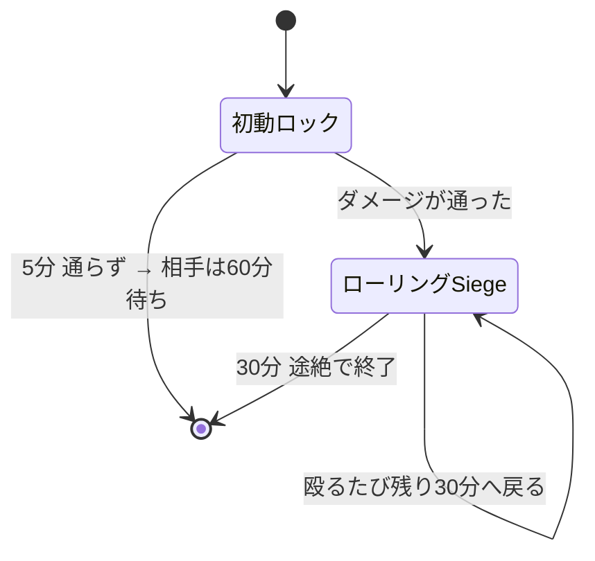
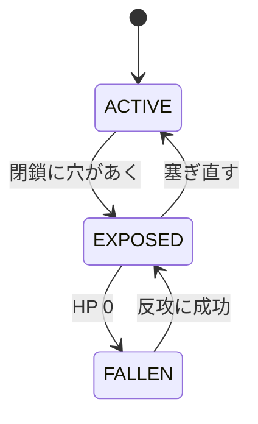

Siegeは、敵国の**領土コア**を破壊して土地を奪う仕組みです。
**このページはルールの説明です。** 効率よく落とす手順は[攻める](../attack/)、
守りの作り方は[拠点を作る](../base/)と[要塞を設計する](../fortress/)にあります。

**敵国の補強ブロックか領土コアを攻撃した時点で、Siegeは始まります。** 宣戦布告の操作はありません。

やることは4段階です。**外側の壁を抜き、コアを露出させ、HPを削り、30分守り切る。**

| 段階 | 時間 | ここで起きること |
|---|---:|---|
| 初動ロック | 5分 | 敵の補強かコアを殴った時点で始まる。まだダメージが通っていなくてもよい |
| ローリングSiege | 30分 | 実際にダメージが入ると移行。殴り続ける限り延長される |
| 陥落後 | 30分 | コアHPが0になってから。防衛側が取り返す最後の機会 |
| 決着 | — | 占領、または首都なら復興エピソードの開始 |

### 何で攻撃するのか

攻撃手段は**CBCの重砲・Warnauticsの爆弾やC4・採掘**の3つです。
コアが**露出していない**うちは、どれを使っても壁を削っているだけなので、まず閉鎖を破るのが前提になります。
[拠点を作る](../base/#閉鎖が成立している状態)の裏返しです。

どれをどう使うか、何発掛かるかは[攻める](../attack/)にまとめてあります。

## 時間切れになる条件

Siegeに制限時間はありません。終わるのは**手が止まったとき**です。

**攻撃側** — 殴り続ける限り続きます。手を止めて30分が過ぎると、それまでの戦果に関わらず終了します。
つまり「時間が足りない」ことはなく、**途切れさせないこと**だけが条件です。

**防衛側** — 30分しのげば終わります。さらに、相手が最初の5分間1度もダメージを通せなければ、
そこで終了したうえで**相手に60分のクールダウン**が付きます。

:::caution[初動ロックだけではコアの回復は止まりません]
コアの自然回復が止まるのは**ローリングSiege中と陥落中**です。
攻撃側が初動ロックのまま5分を無駄にすると、守備側は回復しながら準備できます。
:::

## コアの状態

コアへHPダメージが通るのは `EXPOSED` の間だけです。

閉鎖については[拠点を作る](../base/)を見てください。ここでは「穴が開けば殴れる、塞がれば殴れない」とだけ覚えれば足ります。

### コアの自然回復

攻撃を受けた後、**5分間ダメージがなければ**回復が始まり、以後60秒ごとに最大HPの1%を回復します。
次のいずれかに当てはまる間は回復しません。

- ローリングSiege中
- 陥落中
- 維持費の長期未払いでコア回復が停止中
- コアが設定中・無効・敗北済みなどの回復不能状態

塞ぎ直しても戦況が即座に戻るわけではありません。修復待ち・補強の起動時間・回復待ちがあるため、
**攻撃側には破口を維持する意味が、防衛側には被弾を止める意味があります。**

## 攻撃できるか確かめる

殴っても何も始まらないときは、次のどれかです。上から順に確かめてください。

| 心当たり | 攻撃できるようになるまで |
|---|---|
| 相手が同じ国、または同盟国 | ならない。対象を変える |
| 相手のコアが再建中・占領猶予中 | 猶予が明けるまで（既定6開放時間） |
| 両国が講和で停戦中 | 停戦が終わるまで |
| 直前に攻撃して弾かれた | 再試行クールダウンの既定60分 |
| 殴った物が補強ブロックでもコアでもない | ならない。そもそも攻撃対象ではない |

どれにも当てはまらなければ、殴った時点でSiegeは始まっています。

### 無所属で攻撃する場合

無所属プレイヤーでも攻撃できます。その場合は国家ではなく、**そのプレイヤー個人を攻撃勢力とする単独Siege**になります。

- 本人が国家HubのSiegeタブから撤退できます
- 国家ではないため、拠点を自分の領土として占領できません
- 落とした場合は中立化されます

## コアが落ちたあとの30分

コアHPが0になっても所有権はすぐ確定しません。30分の `FALLEN` フェーズに入り、
補強保護が10分ごとに外側から停止していきます。

| 経過 | 補強保護 |
|---|---|
| 0〜10分 | まだ停止なし |
| 10〜20分 | 領土外周2チャンク相当が停止 |
| 20〜30分 | コア中心チャンク以外が停止 |
| 30分 | 全停止、結果を確定 |

### 防衛側の反攻

防衛国メンバーがコアの**12ブロック以内**に入り、攻撃側がいない状態を**累計3分**維持すると奪還成功です。

| 現場の状況 | 反攻ゲージ |
|---|---|
| 防衛側だけがいる | 増加 |
| 攻防どちらもいる | 停止 |
| 正規防衛メンバーがいない（傭兵だけ） | 半分の速度で減少 |

ダウン・拘束・収監・死亡・スペクテイターは人数に入りません。
成功するとコアは最大HPの25%で `EXPOSED` へ復帰します。確保地点は壊れた戦場のままなので、
閉鎖・補強・HP回復まで終わらせる必要があります。

### 30分を守り切られた場合

**首都コア**なら所有国は変わりません。中心チャンクだけを再建領域として保持し、コアは最大HPの25%で再建状態になります。
既定6開放時間の再攻撃猶予が付き、敗戦国の**復興エピソード**が始まります。

**拠点コア**なら、国家攻撃者は他領土と競合しない最大半径まで縮めて占領します。
占領コアは最大HPの25%で再開し、同じく6開放時間の猶予が付きます。競合で割り当てられない場合は中立化します。

## 負けたあと

**首都が完全陥落すると、敗戦国に復興エピソードが作られます。** ここで終わりではありません。
国家ハブ（`N`）の「復興・派遣」画面から、進捗・残り資格時間・戦史を確認できます。

| | 既定 |
|---|---:|
| 支援資格期間 | 42開放時間 |
| 同じ種類の復興を再利用するクールダウン | 84開放時間 |

### 復興の進捗

進捗は4つの要素の積み上げで決まります。**始めただけで3割が入り**、残りは自分で取り戻します。

| 要素 | 進捗 |
|---|---:|
| 復興開始時の基礎 | 30% |
| 首都を**再封鎖し、10開放分維持**する | +30% |
| 開戦時の防壁HP評価まで復旧する | +20% |
| 維持費を実際に**再決済**する | +20% |

最初にやることは[閉鎖のやり直し](../base/#閉鎖が成立している状態)です。
そこから10開放分もたせて初めて3割が入るので、**落とされた直後に急いで攻め返すより、まず閉じるほうが早いです。**

### 防壁の復旧は「量」ではなく「質」で見ます

開戦時、最初の有効な攻撃を受けた時点で、**そのときの補強の最大HPと個数**が保存されます。
復旧判定は同じ個数の上限内で実HPを合計します。上限は既定4,096個で、**強い補強から順に**評価されます。

:::caution[丸石を何千個置いても戻りません]
開戦時にダイヤ補強が2個（640HP）だったなら、評価対象は2個のままです。
そこへ丸石を数千個置いても、評価されるのは強い順に2個＝**64HPにしかなりません。**

元の領域内で自国が補強できる場所なら、**位置を変えるのは自由**です。他国の補強は評価されません。
:::

復旧を確認するには対象チャンクが読み込まれている必要があります。
**評価のための強制ロードは行いません。** 自分で見に行ってください。

### できること

- **再建保護を自ら放棄して攻勢へ戻る**ことができます。守りを捨てて報復に向かう選択です
- 落とした相手を**宿敵として表示**できます
- 戦史の公開範囲（公開／自国のみ）を選べます

:::note[復興基金は既定で無効です]
台帳・上限・審査の仕組みは実装されていますが、**既定設定では基金そのものが無効**です。
有効化しない限り、敗戦しただけで自動的に金貨が配布されることはありません。
:::

:::caution[未執筆]
国家間派遣契約（他国の戦争へ傭兵として参加する仕組み）はまだ書いていません。
元資料は `recovery_dispatch_plan.md` です。
:::
