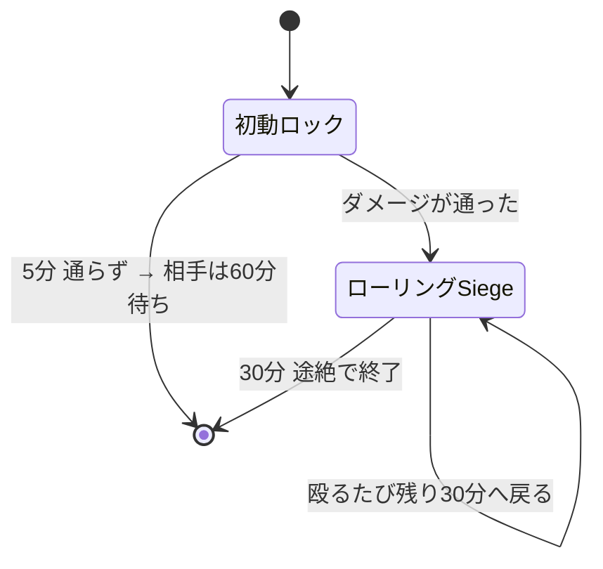
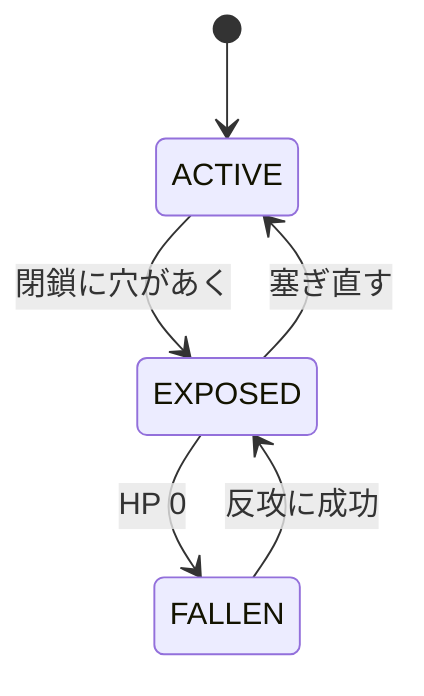

Siegeは、敵国の**領土コア**を破壊して土地を奪う仕組みです。
守りの作り方そのものは[拠点を作る](../base/)にあります。

**敵国の補強ブロックか領土コアを攻撃した時点で、Siegeは始まります。** 宣戦布告の操作はありません。

やることは4段階です。**外側の壁を抜き、コアを露出させ、HPを削り、30分守り切る。**

| 段階 | 時間 | ここで起きること |
|---|---:|---|
| 初動ロック | 5分 | 敵の補強かコアを殴った時点で始まる。まだダメージが通っていなくてもよい |
| ローリングSiege | 30分 | 実際にダメージが入ると移行。殴り続ける限り延長される |
| 陥落後 | 30分 | コアHPが0になってから。防衛側が取り返す最後の機会 |
| 決着 | — | 占領、または首都なら復興エピソードの開始 |

### 何で攻撃するのか

素手やツルハシでも補強は削れますが、現実的な手段は次の3つです。数値は[外殻を抜く](#外殻を抜く)にまとめてあります。

| 手段 | 向いている場面 |
|---|---|
| **CBCの重砲** | 主力。壁を抜き、露出したコアへ直撃させる。直撃には2.5倍が付く |
| **Warnauticsの爆弾・C4** | C4は歩兵が壁へ取り付ける局所突破。航空爆弾は範囲攻撃 |
| **採掘** | 時間は掛かるが確実。補強HPを削り切ってから壊せる |

コアが**露出していない**うちは、どれを使っても壁を削っているだけです。
まず閉鎖を破ることが前提で、[拠点を作る](../base/#閉鎖が成立している状態)の裏返しになります。

:::note[時間はサーバー開放中だけ進みます]
タイマーは原則として**サーバー開放時間中だけ**進みます。閉鎖時間をまたいでも残り時間を実時間で消費しません。
:::

## 時間切れになる条件

Siegeに制限時間はありません。終わるのは**手が止まったとき**です。

**攻撃側** — 殴り続ける限り続きます。手を止めて30分が過ぎると、それまでの戦果に関わらず終了します。
つまり「時間が足りない」ことはなく、**途切れさせないこと**だけが条件です。

**防衛側** — 30分しのげば終わります。さらに、相手が最初の5分間1度もダメージを通せなければ、
そこで終了したうえで**相手に60分のクールダウン**が付きます。

:::caution[初動ロックだけではコアの回復は止まりません]
コアの自然回復が止まるのは**ローリングSiege中と陥落中**です。
攻撃側が初動ロックのまま5分を無駄にすると、守備側は回復しながら準備できます。
:::

## コアの状態

コアへHPダメージが通るのは `EXPOSED` の間だけです。

閉鎖については[拠点を作る](../base/)を見てください。ここでは「穴が開けば殴れる、塞がれば殴れない」とだけ覚えれば足ります。

### コアの自然回復

攻撃を受けた後、**5分間ダメージがなければ**回復が始まり、以後60秒ごとに最大HPの1%を回復します。
次のいずれかに当てはまる間は回復しません。

- ローリングSiege中
- 陥落中
- 維持費の長期未払いでコア回復が停止中
- コアが設定中・無効・敗北済みなどの回復不能状態

塞ぎ直しても戦況が即座に戻るわけではありません。修復待ち・補強の起動時間・回復待ちがあるため、
**攻撃側には破口を維持する意味が、防衛側には被弾を止める意味があります。**

## 攻撃できるか確かめる

殴っても何も始まらないときは、次のどれかです。上から順に確かめてください。

| 心当たり | 攻撃できるようになるまで |
|---|---|
| 相手が同じ国、または同盟国 | ならない。対象を変える |
| 相手のコアが再建中・占領猶予中 | 猶予が明けるまで（既定6開放時間） |
| 両国が講和で停戦中 | 停戦が終わるまで |
| 直前に攻撃して弾かれた | 再試行クールダウンの既定60分 |
| 殴った物が補強ブロックでもコアでもない | ならない。そもそも攻撃対象ではない |

どれにも当てはまらなければ、殴った時点でSiegeは始まっています。

### 無所属で攻撃する場合

無所属プレイヤーでも攻撃できます。その場合は国家ではなく、**そのプレイヤー個人を攻撃勢力とする単独Siege**になります。

- 本人が国家HubのSiegeタブから撤退できます
- 国家ではないため、拠点を自分の領土として占領できません
- 落とした場合は中立化されます

## 外殻を抜く

### 壁が残っている限り中には通りません

**補強された壁が残っているあいだ、その背後の領土コアや車両コアへ爆発ダメージは通りません。**
砲弾や爆発は、まず実際に当たった補強を削ります。射線または爆発の経路が開いてから、ようやく内部へ届きます。

CBCの爆発でブロックが変換されたり丸石化したりした場合も、古い補強データは新しいブロックへ引き継がれます。
**壊して置き直せば補強済みになる、ということは起きません。**

### 採掘で崩すこともできます

補強ブロックは通常の採掘では即座に壊れません。**採掘の試行は補強HPへ処理されます。**
補強を削り切ってから、ようやく通常のブロックとして壊せるようになります。

敵領土内で足場や遮蔽を自由に作ることは[Bastion](../base/#bastion領土保護)が制限します。

### 覚えておくのはこの3つ

数値は[兵器のダメージ](../../reference/weapon-damage/)にまとめてあります。戦い方に効くのは次の3点です。

**重砲は露出したコアへの直撃で2.5倍**になります。爆風範囲に入っただけでは付きません。
外殻を開けたあとは、砲を正しい射線へ運んでコアへ直撃させるのが最も効率的です。
[車両コア](../../reference/vehicle-core/)が射線を作る道具になるのはこのためです。

**機関砲と機関銃はコアを削れません。** 補強は少しずつ削れますが、連射だけで壁を無視してコアを落とすことはできません。

**C4は接触が要ります。** 取付面に64と強力ですが、歩兵が壁まで歩いて取り付けなければ使えません。
逆にいえば、壁に取り付かれる前に止められれば無効化できます。

## 歩兵によるコア破壊工作

上の重砲をコア室まで運べないときの代替手段です。既定で有効。
**要るのは溶接機とTNT20個、そして約5分の時間と、その間ずっと立っていられる安全です。**

### 手順

1. 敵の領土コアを `EXPOSED` にする
2. メインハンドに**溶接機**、オフハンドに**TNTを4個以上**持つ
3. コアから4ブロック以内で、コアを見ながらスニーク右クリック
4. その場で**20秒**、視線・姿勢・道具を維持する
5. TNTを4個消費し、**40秒の信管**が作動する

### 途中で中止になる条件

設置の20秒間に次のどれかが起きると中止されます。**完了するまでTNTは消費しません。**

- 0.5ブロックを超えて動く
- 被弾する
- コアから視線を外す、道具を持ち替える
- ダウン・拘束される
- ログアウトする

### 数えておくこと

| | |
|---|---|
| 1回のダメージ | コア最大HPの20% |
| 落とすのに必要な回数 | 無軽減でも5回（TNT20個、約5分） |
| 同時進行 | 1コアにつき1件、攻撃者1人につき1件 |
| 作動中の警告 | 周囲32ブロックにBossbarと毎秒の警告音 |

:::caution[サーバー再起動をまたぎません]
設置済みの工作は保存されません。開放時間の終わりをまたぐ計画は立てないでください。
:::

### 防衛側が解除する

所有国・同盟国のプレイヤーが**溶接機でコアをスニーク右クリックし、5秒維持**すると解除できます。

解除担当者が被弾・移動・ダウンで条件を失うと進捗はリセットされます。
再封鎖、停戦、所有権の変更、開放時間の終了、攻撃者の不在でも安全側に中止されます。

## コアが落ちたあとの30分

コアHPが0になっても所有権はすぐ確定しません。30分の `FALLEN` フェーズに入り、
補強保護が10分ごとに外側から停止していきます。

| 経過 | 補強保護 |
|---|---|
| 0〜10分 | まだ停止なし |
| 10〜20分 | 領土外周2チャンク相当が停止 |
| 20〜30分 | コア中心チャンク以外が停止 |
| 30分 | 全停止、結果を確定 |

### 防衛側の反攻

防衛国メンバーがコアの**12ブロック以内**に入り、攻撃側がいない状態を**累計3分**維持すると奪還成功です。

| 現場の状況 | 反攻ゲージ |
|---|---|
| 防衛側だけがいる | 増加 |
| 攻防どちらもいる | 停止 |
| 正規防衛メンバーがいない（傭兵だけ） | 半分の速度で減少 |

ダウン・拘束・収監・死亡・スペクテイターは人数に入りません。
成功するとコアは最大HPの25%で `EXPOSED` へ復帰します。確保地点は壊れた戦場のままなので、
閉鎖・補強・HP回復まで終わらせる必要があります。

### 30分を守り切られた場合

**首都コア**なら所有国は変わりません。中心チャンクだけを再建領域として保持し、コアは最大HPの25%で再建状態になります。
既定6開放時間の再攻撃猶予が付き、敗戦国の**復興エピソード**が始まります。

**拠点コア**なら、国家攻撃者は他領土と競合しない最大半径まで縮めて占領します。
占領コアは最大HPの25%で再開し、同じく6開放時間の猶予が付きます。競合で割り当てられない場合は中立化します。

## 負けたあと

:::tip[ここで終わりではありません]
首都を落とされると**復興エピソード**が始まります。再封鎖、補強の復旧、維持費、支援の受給資格、
再建保護の放棄、ライバル指定、戦史の公開範囲を国家Hubから扱えます。
滅んだら終わりにしないための仕組みなので、落とされた側はまずここを見てください。
:::

:::caution[未執筆]
復興エピソードの詳細、復興基金、国家間派遣契約はまだ書いていません。
元資料は `recovery_dispatch_plan.md` です。
:::
