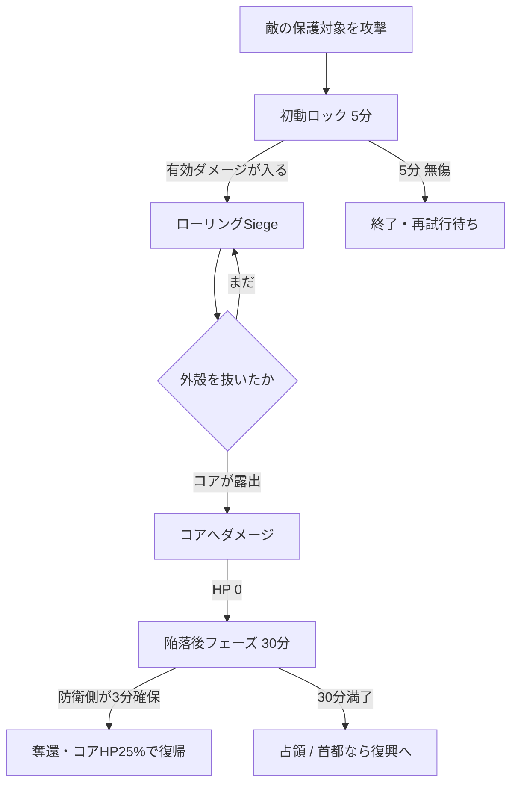
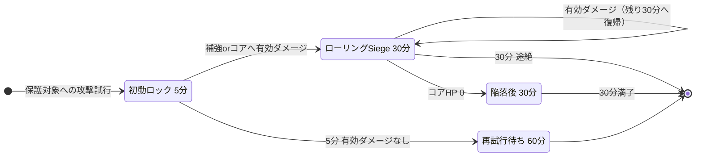
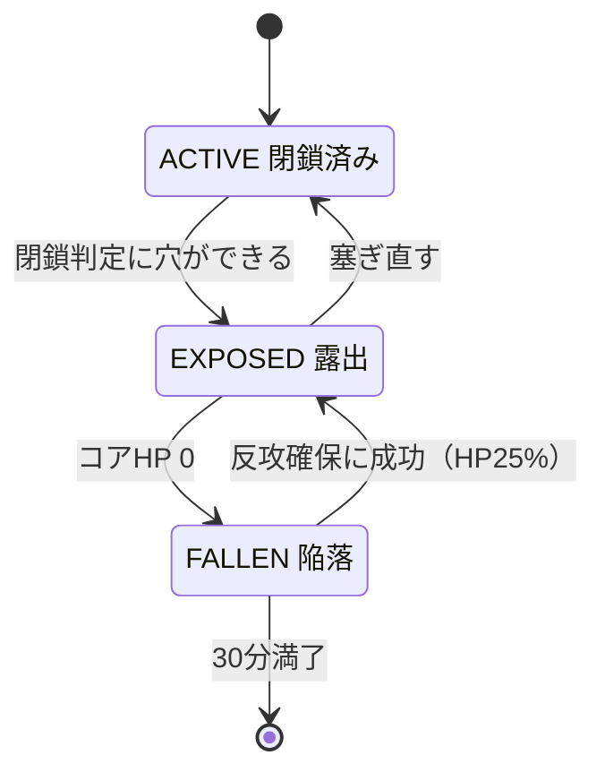
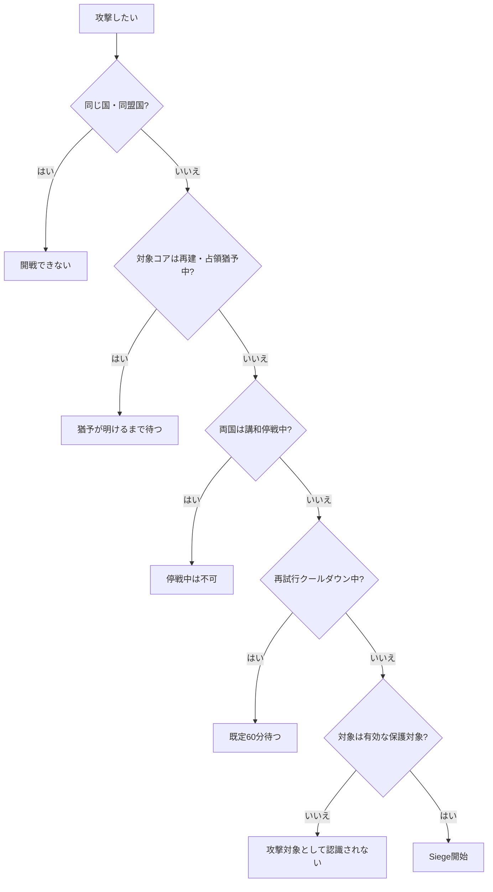
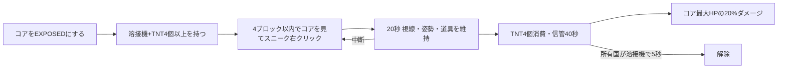

Siegeは、敵国の**領土コア**を破壊して土地を奪う仕組みです。
このページは攻める側と守る側の両方を扱います。守りの作り方そのものは
[拠点を作る](../base/)にあります。

## 全体の流れ

## タイマー

タイマーは原則として**サーバー開放時間中だけ**進みます。閉鎖時間をまたいでも残り時間を実時間で消費しません。

| フェーズ | 既定 | 入る条件 |
|---|---:|---|
| 初動ロック | 5分 | 敵の保護対象への攻撃試行。有効ダメージはまだ不要 |
| ローリングSiege | 30分 | 補強またはコアへ実際に有効ダメージが入る |
| 陥落後 | 30分 | コアHPが0になる |

:::caution[自然回復が止まるのはローリング以降]
コアの自然回復は**ローリングSiege中と陥落中に止まります**。初動ロックだけでは止まりません。
攻撃側が初動ロックのまま5分を無駄にすると、守備側は回復しながら準備できます。
:::

## コアの状態

領土コアへHPダメージが通るのは、基本的に `EXPOSED` の間だけです。

攻撃を受けた後、**5分間ダメージがなければ自然回復**が始まり、以後60秒ごとに最大HPの1%を回復します。
ただしローリングSiege中、陥落中、維持費の長期未払い中、設定中・無効・敗北済みでは回復しません。

塞ぎ直しても即座に戦況が戻るわけではありません。修復待ち・補強の起動時間・自然回復待ちがあるため、
**攻撃側には破口を維持する意味が、防衛側には被弾を止める意味があります。**

## 開戦できない場合

無所属プレイヤーでも攻撃できますが、その場合は国家ではなく**個人を攻撃勢力とする単独Siege**になります。
本人が国家HubのSiegeタブから撤退でき、拠点を自分の領土として占領することはできません（落とせば中立化）。

## 歩兵によるコア破壊工作

重砲をコア室まで運べない場合の代替手段です。時間と危険を伴います。

- 設置中に0.5ブロックを超えて動く、被弾、視線や工具を外す、ダウン・拘束、ログアウトで中止されます。
  **設置完了前はTNTを消費しません。**
- 作動中は周囲32ブロックへBossbarと毎秒の警告音が出ます。
- 無軽減でも**5回・TNT20個・約5分**が必要です。
- 1コアにつき同時1件、攻撃者1人につき同時1件です。
- 設置済みの工作はサーバー再起動をまたいで保存されません。

## コアが落ちたあとの30分

コアHPが0になっても所有権はすぐ確定しません。30分の `FALLEN` フェーズに入り、
補強保護が10分ごとに外側から停止します。

| 経過 | 段階 | 補強保護 |
|---|---|---|
| 0〜10分 | 段階0 | 段階停止はまだなし |
| 10〜20分 | 段階1 | 領土外周2チャンク相当が停止 |
| 20〜30分 | 段階2 | コア中心チャンク以外が停止 |
| 30分 | 最終 | 全補強保護が停止し、結果を確定 |

### 防衛側の反攻

防衛国メンバーがコアの**12ブロック以内**に入り、攻撃側がいない状態を**累計3分**維持すると奪還成功です。

- 防衛側のみ → ゲージ増加
- 攻防両方がいる → 停止
- 正規防衛メンバー不在（防衛傭兵だけ） → 半速で減少

ダウン・拘束・収監・死亡・スペクテイターは人数に入りません。
成功するとコアは最大HPの25%で `EXPOSED` へ復帰します。

### 30分満了時

首都コアなら所有国は変わらず、中心チャンクだけを再建領域として保持し、コアは最大HPの25%で再建状態になります。
既定6開放時間の再攻撃猶予が付き、**敗戦国の復興エピソードが始まります。**

拠点コアなら、国家攻撃者は他領土と競合しない最大半径まで縮めて占領します。
占領コアは最大HPの25%で再開し、同じく6開放時間の猶予が付きます。競合で割り当てられない場合は中立化します。

## 負けたあと

:::tip[ここで終わりではありません]
首都を落とされると**復興エピソード**が始まります。再封鎖、補強の復旧、維持費、支援の受給資格、
再建保護の放棄、ライバル指定、戦史の公開範囲を国家Hubから扱えます。
滅んだら終わりにしないための仕組みなので、落とされた側はまずここを見てください。
:::

:::caution[未執筆]
復興エピソードの詳細、復興基金、派遣契約はまだ書いていません。
元資料は `recovery_dispatch_plan.md` です。
:::

## 武器とダメージ

:::caution[未執筆]
CBC・Warnauticsの既定ダメージ表、遮蔽原則、採掘による破壊は未移植です。
元資料は `siege_gameplay_guide.md` の第6章です。
:::
