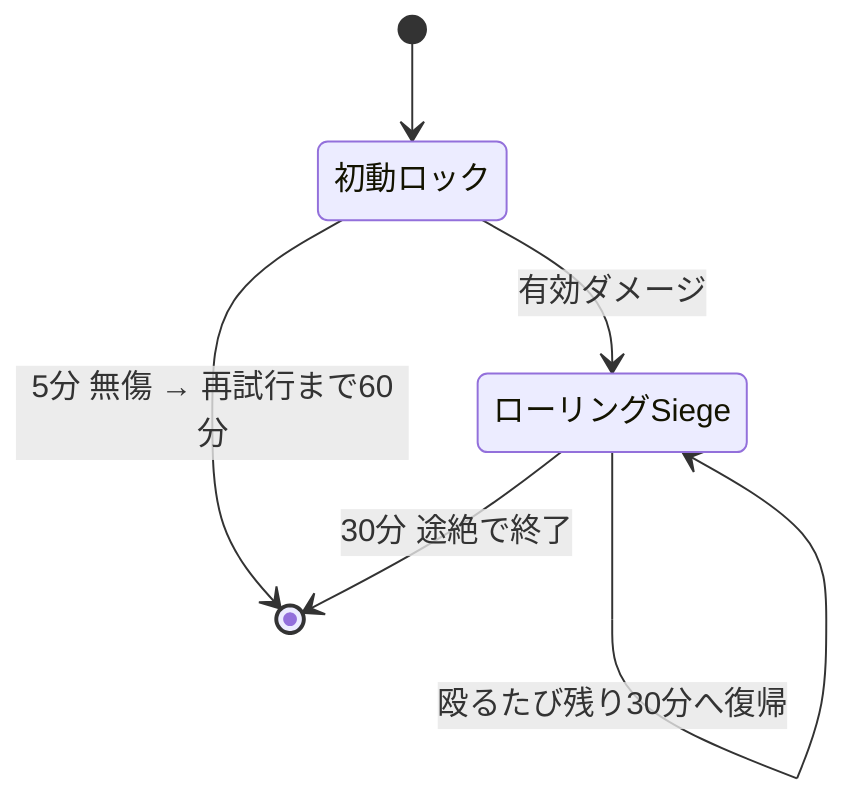
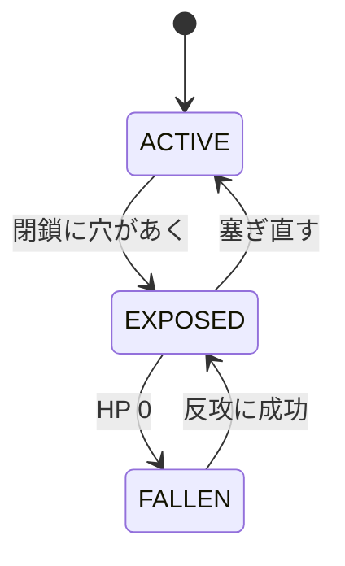

Siegeは、敵国の**領土コア**を破壊して土地を奪う仕組みです。
守りの作り方そのものは[拠点を作る](../base/)にあります。

戦争は4つの段階を順に進みます。**外側の壁を抜き、コアを露出させ、HPを削り、30分守り切る。** これだけです。

| 段階 | 時間 | ここで起きること |
|---|---:|---|
| 初動ロック | 5分 | 攻撃を試みた時点で始まる。まだ有効ダメージは要らない |
| ローリングSiege | 30分 | 実際にダメージが入ると移行。殴り続ける限り延長される |
| 陥落後 | 30分 | コアHPが0になってから。防衛側が取り返す最後の機会 |
| 決着 | — | 占領、または首都なら復興エピソードの開始 |

:::note[時間はサーバー開放中だけ進みます]
タイマーは原則として**サーバー開放時間中だけ**進みます。閉鎖時間をまたいでも残り時間を実時間で消費しません。
:::

## タイマーの動き

表で分かりにくいのは**延長と打ち切り**だけです。そこだけ図にします。

**攻撃側**は殴り続ける限り時間を買えます。手を止めて30分が過ぎると、そこまでの戦果に関わらず終了です。

**防衛側**は30分しのげば勝ちです。初動ロックの5分を無傷で耐えれば、相手には60分のクールダウンが付きます。

:::caution[初動ロックだけではコアの回復は止まりません]
コアの自然回復が止まるのは**ローリングSiege中と陥落中**です。
攻撃側が初動ロックのまま5分を無駄にすると、守備側は回復しながら準備できます。
:::

## コアの状態

コアへHPダメージが通るのは `EXPOSED` の間だけです。

閉鎖については[拠点を作る](../base/)を見てください。ここでは「穴が開けば殴れる、塞がれば殴れない」とだけ覚えれば足ります。

### コアの自然回復

攻撃を受けた後、**5分間ダメージがなければ**回復が始まり、以後60秒ごとに最大HPの1%を回復します。
次のいずれかに当てはまる間は回復しません。

- ローリングSiege中
- 陥落中
- 維持費の長期未払いでコア回復が停止中
- コアが設定中・無効・敗北済みなどの回復不能状態

塞ぎ直しても戦況が即座に戻るわけではありません。修復待ち・補強の起動時間・回復待ちがあるため、
**攻撃側には破口を維持する意味が、防衛側には被弾を止める意味があります。**

## 攻撃できるか確かめる

攻撃が弾かれたときは、上から順に当てはまるものを探してください。

| 状態 | どうなるか | 対処 |
|---|---|---|
| 同じ国・同盟国が相手 | 開戦できない | 対象を変える |
| 対象コアが再建・占領猶予中 | 開戦できない | 猶予が明けるまで待つ（既定6開放時間） |
| 両国が講和停戦中 | 開戦できない | 停戦が終わるまで待つ |
| 再試行クールダウン中 | 開戦できない | 既定60分待つ |
| 対象が有効な保護対象でない | 開戦できない | そもそも攻撃対象ではない |

上のどれにも当てはまらなければ、攻撃した時点でSiegeが始まります。

### 無所属で攻撃する場合

無所属プレイヤーでも攻撃できます。その場合は国家ではなく、**そのプレイヤー個人を攻撃勢力とする単独Siege**になります。

- 本人が国家HubのSiegeタブから撤退できます
- 国家ではないため、拠点を自分の領土として占領できません
- 落とした場合は中立化されます

## 歩兵によるコア破壊工作

重砲をコア室まで運べない場合の代替手段です。既定で有効です。

1. 敵の領土コアを `EXPOSED` にする
2. メインハンドに**溶接機**、オフハンドに**TNTを4個以上**持つ
3. コアから4ブロック以内で、コアを見ながらスニーク右クリック
4. その場で**20秒**、視線・姿勢・道具を維持する
5. TNTを4個消費し、**40秒の信管**が作動する

設置中に0.5ブロックを超えて動く、被弾する、視線や工具を外す、ダウン・拘束される、ログアウトすると中止されます。
**設置が完了するまでTNTは消費しません。**

| | |
|---|---|
| 1回のダメージ | コア最大HPの20% |
| 落とすのに必要な回数 | 無軽減でも5回（TNT20個、約5分） |
| 同時進行 | 1コアにつき1件、攻撃者1人につき1件 |
| 警告 | 作動中は周囲32ブロックにBossbarと毎秒の警告音 |
| 解除 | 所有国・同盟国が溶接機でスニーク右クリック、5秒維持 |

解除担当者が被弾・移動・ダウンで条件を失うと解除進捗はリセットされます。
再封鎖・停戦・所有権の変更・開放時間の終了・攻撃者の不在では安全側に中止されます。
設置済みの工作は**サーバー再起動をまたいで保存されません。**

## コアが落ちたあとの30分

コアHPが0になっても所有権はすぐ確定しません。30分の `FALLEN` フェーズに入り、
補強保護が10分ごとに外側から停止していきます。

| 経過 | 補強保護 |
|---|---|
| 0〜10分 | まだ停止なし |
| 10〜20分 | 領土外周2チャンク相当が停止 |
| 20〜30分 | コア中心チャンク以外が停止 |
| 30分 | 全停止、結果を確定 |

### 防衛側の反攻

防衛国メンバーがコアの**12ブロック以内**に入り、攻撃側がいない状態を**累計3分**維持すると奪還成功です。

| 現場の状況 | 反攻ゲージ |
|---|---|
| 防衛側だけがいる | 増加 |
| 攻防どちらもいる | 停止 |
| 正規防衛メンバーがいない（傭兵だけ） | 半分の速度で減少 |

ダウン・拘束・収監・死亡・スペクテイターは人数に入りません。
成功するとコアは最大HPの25%で `EXPOSED` へ復帰します。確保地点は壊れた戦場のままなので、
閉鎖・補強・HP回復まで終わらせる必要があります。

### 30分を守り切られた場合

**首都コア**なら所有国は変わりません。中心チャンクだけを再建領域として保持し、コアは最大HPの25%で再建状態になります。
既定6開放時間の再攻撃猶予が付き、敗戦国の**復興エピソード**が始まります。

**拠点コア**なら、国家攻撃者は他領土と競合しない最大半径まで縮めて占領します。
占領コアは最大HPの25%で再開し、同じく6開放時間の猶予が付きます。競合で割り当てられない場合は中立化します。

## 負けたあと

:::tip[ここで終わりではありません]
首都を落とされると**復興エピソード**が始まります。再封鎖、補強の復旧、維持費、支援の受給資格、
再建保護の放棄、ライバル指定、戦史の公開範囲を国家Hubから扱えます。
滅んだら終わりにしないための仕組みなので、落とされた側はまずここを見てください。
:::

:::caution[未執筆]
復興エピソードの詳細、復興基金、国家間派遣契約はまだ書いていません。
元資料は `recovery_dispatch_plan.md` です。
:::

## 武器とダメージ

:::caution[未執筆]
CBC・Warnauticsの既定ダメージ表、遮蔽原則、採掘による破壊は未移植です。
元資料は `siege_gameplay_guide.md` の第6章です。
:::
